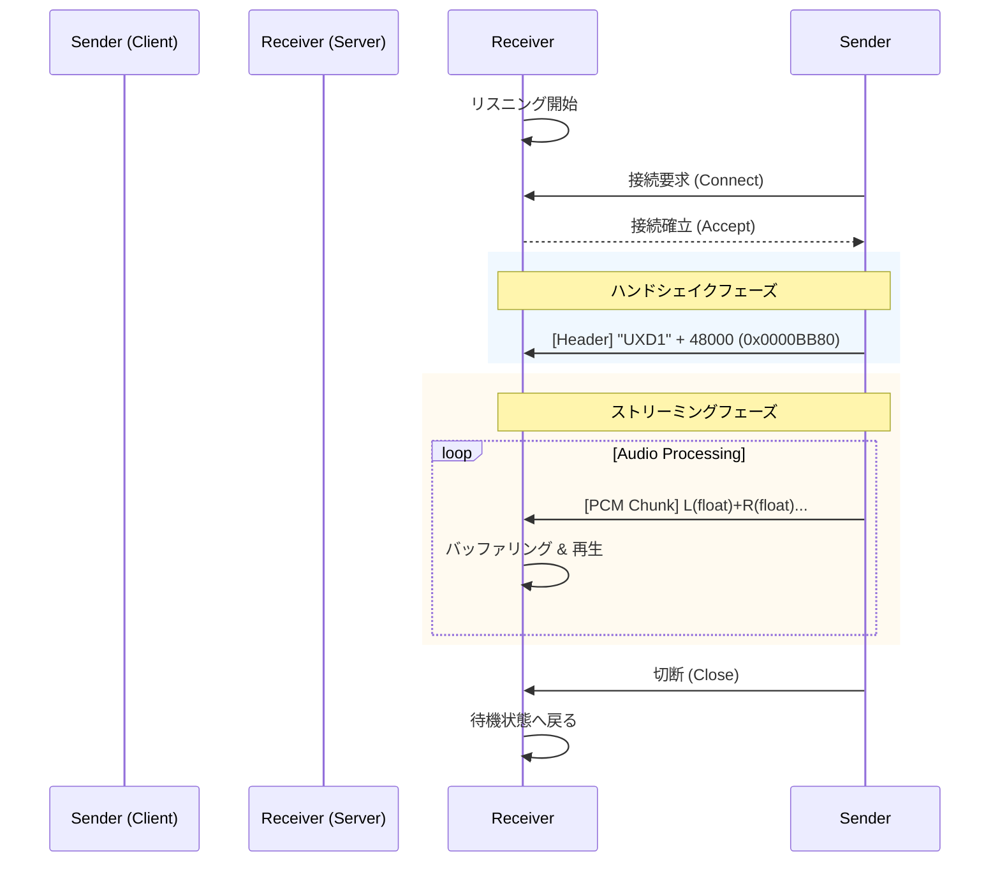

# UX Direct Audio Link プロトコル仕様書 (Ver 1.1)

## 1. 概要

**UX Direct Audio Link (UXDAL)** は、ローカルマシン上のアプリケーション間で、低遅延かつ高音質なオーディオストリームを転送するための軽量なプロセス間通信（IPC）プロトコルです。

本プロトコルを使用することで、OSの仮想オーディオデバイス（ドライバ）を経由することなく、アプリケーションA（Sender）の再生音をアプリケーションB（Receiver）へ直接ルーティングすることが可能です。

**主な用途:**

* 通話アプリでの画面共有時に、特定のアプリ音声を共有に乗せず、ローカルモニタリングのみ行う。
* DAWや音楽プレイヤーの出力を、配信ミキサーアプリへ直接注入する。
* 複数のオーディオソースを単一の出力管理ソフトへ集約する。

## 2. 通信レイヤー

本プロトコルは、TCP/IPスタックのオーバーヘッドを回避するため、OSネイティブのIPC機能を使用します。

### 2.1 接続方式

* **トランスポート:** ストリーム指向のソケット通信
* **Windows:** 名前付きパイプ (Named Pipe)
* **macOS / Linux:** Unixドメインソケット (Unix Domain Socket)

### 2.2 接続アドレス

Receiver（サーバー側）は以下のパスで接続を待ち受けます。

| OS | パス (Pipe Name / Socket Path) |
| --- | --- |
| **Windows** | `\\.\pipe\ux_audio_router_pipe` |
| **macOS / Linux** | `/tmp/ux_audio_router.sock` |

> **注意:** macOS/Linux環境では、Receiver終了時にソケットファイルが残留しないよう、起動時に `unlink` 処理を行うことを推奨します。

## 3. プロトコル仕様 (UXD1)

接続確立後、Senderは直ちにハンドシェイクヘッダーを送信し、続いてPCMデータを連続的に送信します。双方向通信ではなく、SenderからReceiverへの単方向ストリームとなります。

### 3.1 データ構造

データストリームは「ヘッダー部（初回のみ）」と「データ部（永続）」で構成されます。

#### A. ハンドシェイクヘッダー (計8バイト)

接続開始時に**一度だけ**送信されるメタデータです。Receiverはこの情報を基にオーディオエンジンを初期化します。

| オフセット | サイズ | 型 | 内容 | 値 / 説明 |
| --- | --- | --- | --- | --- |
| 0 | 4 bytes | ASCII String | **Magic** | `"UXD1"` (プロトコル識別子) |
| 4 | 4 bytes | UInt32 (LE) | **Sample Rate** | 例: `44100`, `48000` (Senderの動作レート) |

#### B. オーディオデータ部 (Raw PCM)

ヘッダーに続き、以下のフォーマットでエンコードされた音声データが連続して送信されます。

* **形式:** 32-bit Floating Point (IEEE 754)
* **エンディアン:** Little Endian
* **チャンネル:** 2ch ステレオ
* **配置:** Interleaved (L, R, L, R, ...)
* **フレームサイズ:** 8バイト (4バイト L + 4バイト R)

### 3.2 通信シーケンス例



## 4. 実装ガイドライン

### 4.1 Sender (送信側) の責務

1. **フォーマット変換:** 内部処理がFloat32以外の場合、送信前にFloat32へ変換してください。
2. **ブロッキング回避:** ソケットへの書き込みは非同期で行い、オーディオ処理スレッドをブロックしないように実装してください。
3. **エラーハンドリング:** Receiverが見つからない（接続拒否）場合、バックグラウンドで定期的に再接続を試みるか、エラーを無視して処理を継続する設計が望ましいです。

### 4.2 Receiver (受信側) の責務

1. **バッファリング:** IPC通信には微細なジッター（揺らぎ）が存在します。受信データを即座に再生するのではなく、一定量（推奨: 50ms〜200ms、可変設定推奨）バッファリングしてから再生してください。
2. **クロック同期補正:**
* **Underrun (枯渇):** バッファが空になった場合、再生位置を「現在時刻 + バッファ設定値 + マージン」へ再スケジュールし、断続的な音切れを防いでください。
* **Overrun (過多):** 遅延が許容範囲（例: 設定値の3倍）を超えた場合、バッファを破棄して最新のデータにジャンプ（リセット）してください。


3. **複数接続の扱い:** 基本仕様として1対1接続を想定しますが、サーバー実装によっては複数のSenderからの入力をミックスすることも可能です。

## 5. リファレンス実装 (Node.js / Electron)

### ヘッダー生成例 (Sender)

```javascript
const sampleRate = 48000;
const header = Buffer.alloc(8);
header.write('UXD1', 0);          // Magic
header.writeUInt32LE(sampleRate, 4); // Rate
socket.write(header);

```

### ヘッダー解析例 (Receiver)

```javascript
// 受信バッファの先頭8バイトを確認
const magic = buffer.slice(0, 4).toString();
if (magic === 'UXD1') {
    const rate = buffer.readUInt32LE(4);
    initializeAudioContext(rate);
}

```

## 6. バージョン履歴

* **v1.0:** 初期リリース（固定サンプリングレート 44.1kHz、ヘッダーなし）
* **v1.1 (Current):** ハンドシェイクヘッダー導入。サンプリングレートの可変対応。UXD1マジックナンバーの定義。